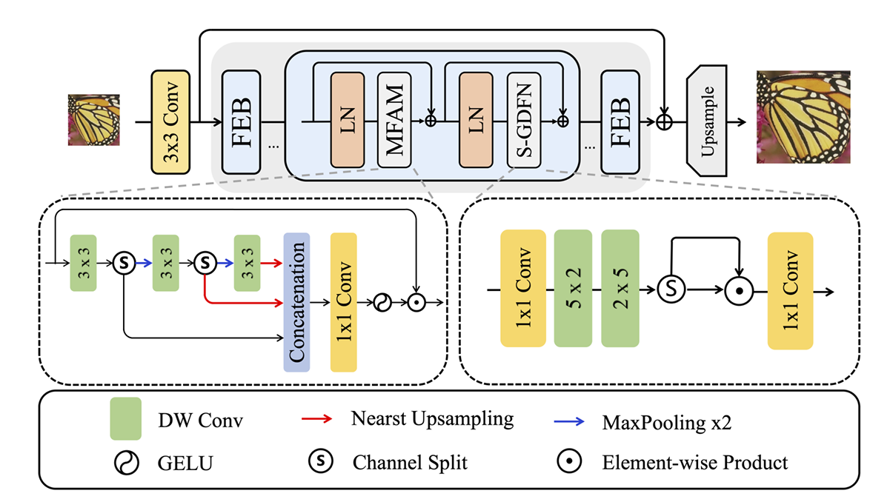
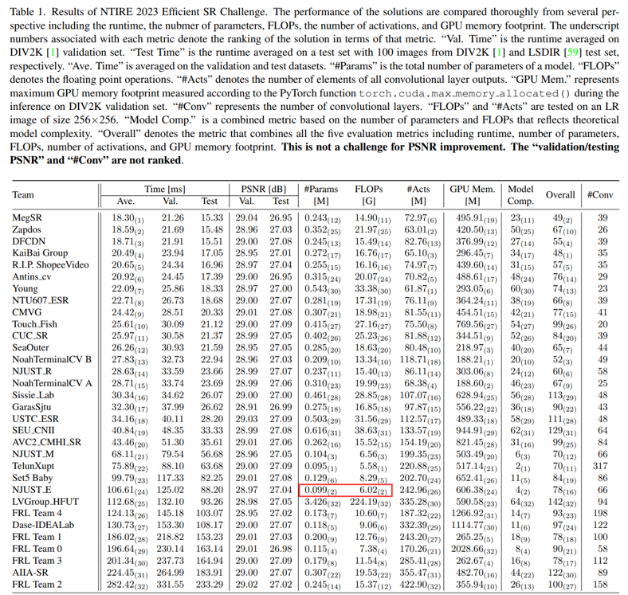
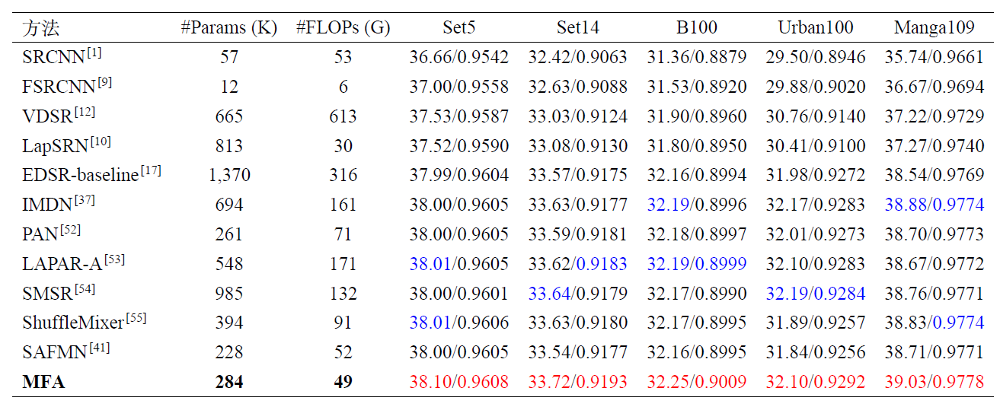
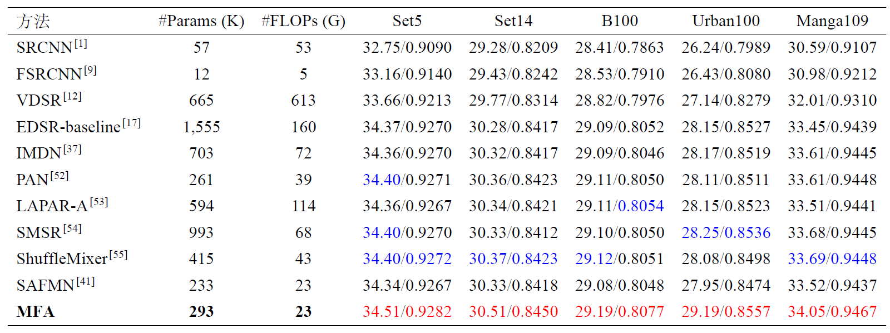
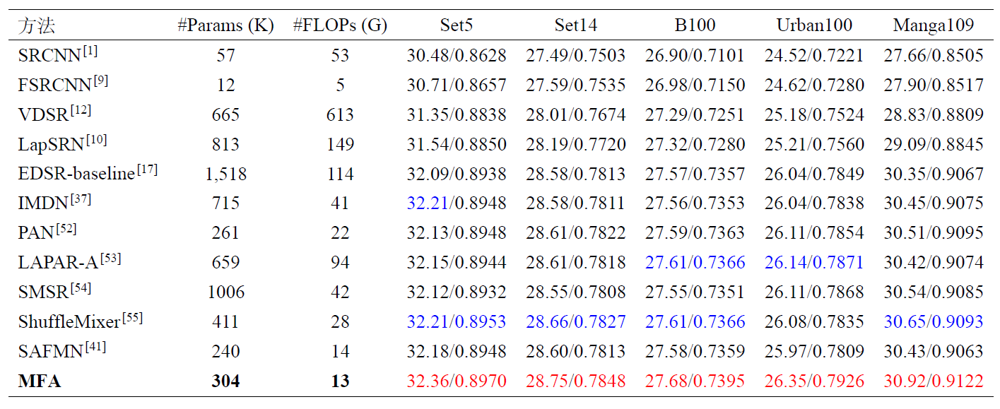
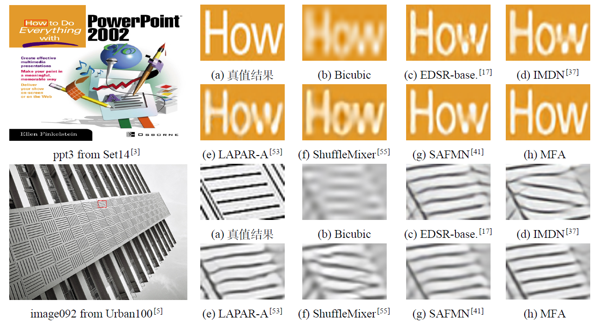

# [NTIRE 2023 Challenge on Efficient Super-Resolution](https://openaccess.thecvf.com/content/CVPR2023W/NTIRE/papers/Li_NTIRE_2023_Challenge_on_Efficient_Super-Resolution_Methods_and_Results_CVPRW_2023_paper.pdf) @ [CVPR 2023](https://cvpr2023.thecvf.com/)

## 📖 MFA: A Lightweight Multi-scale Feature Attention for Image Super-Resolution
### We placed 2nd in the Parameters and FLOPs sub-track of the NTIRE2023 ESR Challenge.
---
<p align="center">
  
</p>

*An overview of the proposed MFA model*

### How to test the model?

1. Run the [`run.sh`] script (./run.sh)
    ```bash
    CUDA_VISIBLE_DEVICES=0 python test_demo.py --data_dir [path to your data dir] --save_dir [path to your save dir] --model_id 16
    ```
    - Be sure the change the directories `--data_dir` and `--save_dir`.

   
### How to calculate the number of parameters, FLOPs, and activations

```python
    from utils.model_summary import get_model_flops, get_model_activation
    from models.team16_MFA import MFA
    model = MFA(dim=33, n_blocks=8, ffn_scale=1.8, upscaling_factor=4)
    
    input_dim = (3, 256, 256)  # set the input dimension
    activations, num_conv = get_model_activation(model, input_dim)
    activations = activations / 10 ** 6
    print("{:>16s} : {:<.4f} [M]".format("#Activations", activations))
    print("{:>16s} : {:<d}".format("#Conv2d", num_conv))

    flops = get_model_flops(model, input_dim, False)
    flops = flops / 10 ** 9
    print("{:>16s} : {:<.4f} [G]".format("FLOPs", flops))

    num_parameters = sum(map(lambda x: x.numel(), model.parameters()))
    num_parameters = num_parameters / 10 ** 6
    print("{:>16s} : {:<.4f} [M]".format("#Params", num_parameters))
```


### Results of NTIRE 2023 Efficient SR Challenge
Our team (NJUST_E) placed 2nd in the Parameters and FLOPs sub-track of the [NTIRE 2023 ESR Challenge](https://openaccess.thecvf.com/content/CVPR2023W/NTIRE/papers/Li_NTIRE_2023_Challenge_on_Efficient_Super-Resolution_Methods_and_Results_CVPRW_2023_paper.pdf).
<p align="center">
  
</p>

----------------------------------------------------------
## 📜 News
- **[2025/03/32]**  We trained MFA with a channel number of 60
- The model architecture is in [`./models/mfa_arch.py`](./models/mfa_arch.py).
- The pretrained models is in [`./checkpoints`](./checkpoints).


## ✨ Experimental Results
 ### Visual Results
[Google Drive](https://drive.google.com/file/d/1_M_EA3iGhPVRJKA4dquwgSUmWDrShiCp/view?usp=sharing ) | [Huggingface](https://huggingface.co/datasets/Zheng-MJ/MFA_Visual_Result/tree/main)

### Results on X2 SR
<p align="center">
  
</p>

### Results on X3 SR
<p align="center">
  
</p>

### Results on X4 SR
<p align="center">
  
</p>

### Visual comparisons for x4 SR
<p align="center">
  
</p>

### Contact
If you have any questions, please feel free to reach me out at mingjunzheng@njust.edu.cn